# Documento de Especificação de Requisitos

## Sistema de Gerenciamento de Clientes (CRUD Customers Management)

---

### CAPA

**Nome do Sistema:** CRUD Customers Management Server
</br>
**Analista Responsável:** João Batista, João Victor Oliveira e Marcos Lima
</br>
**Instituição:** Centro Universitário do Triângulo - UNITRI
</br>
**Disciplina:** Engenharia de Software (ESOF)

---

## 1. INTRODUÇÃO

### 1.1 Objetivo do Documento

Este documento tem como objetivo especificar os requisitos funcionais e não funcionais do Sistema de Gerenciamento de Clientes, utilizando análise estruturada e orientada a objetos para garantir uma solução robusta e escalável.

### 1.2 Objetivo do Projeto

Desenvolver um sistema web para gerenciamento completo de clientes (CRUD - Create, Read, Update, Delete), permitindo cadastro, consulta, atualização e exclusão de informações de clientes de forma segura e eficiente.

### 1.3 Escopo

O sistema contempla:

- Gerenciamento completo de clientes
- Interface RESTful API
- Persistência de dados
- Validações de dados
- Tratamento de erros
- Documentação técnica

---

## 2. GLOSSÁRIO

| Sigla/Termo | Significado                       |
| ----------- | --------------------------------- |
| CRUD        | Create, Read, Update, Delete      |
| API         | Application Programming Interface |
| REST        | Representational State Transfer   |
| HTTP        | HyperText Transfer Protocol       |
| JSON        | JavaScript Object Notation        |
| DTO         | Data Transfer Object              |
| JPA         | Java Persistence API              |
| JDBC        | Java Database Connectivity        |
| UUID        | Universally Unique Identifier     |
| CPF         | Cadastro de Pessoa Física         |
| SQL         | Structured Query Language         |

---

## 3. REQUISITOS FUNCIONAIS

### RF01 - Cadastrar Cliente

**Descrição:** O sistema deve permitir o cadastro de novos clientes.  
**Dados:** Nome, CPF, Email, Telefone, Endereço  
**Validações:** CPF único, Email válido, Campos obrigatórios  
**Prioridade:** Alta

### RF02 - Listar Clientes

**Descrição:** O sistema deve listar todos os clientes cadastrados.  
**Funcionalidades:** Paginação, Ordenação  
**Prioridade:** Alta

### RF03 - Buscar Cliente por ID

**Descrição:** O sistema deve permitir a busca de um cliente específico por ID.  
**Prioridade:** Alta

### RF04 - Atualizar Cliente

**Descrição:** O sistema deve permitir a atualização dos dados de um cliente existente.  
**Validações:** Cliente deve existir, CPF único (se alterado)  
**Prioridade:** Alta

### RF05 - Excluir Cliente

**Descrição:** O sistema deve permitir a exclusão lógica ou física de um cliente.  
**Prioridade:** Média

### RF06 - Validar CPF

**Descrição:** O sistema deve validar o formato e unicidade do CPF.  
**Prioridade:** Alta

### RF07 - Validar Email

**Descrição:** O sistema deve validar o formato do email.  
**Prioridade:** Média

### RF08 - Tratamento de Erros

**Descrição:** O sistema deve retornar mensagens de erro claras e padronizadas.  
**Prioridade:** Alta

---

## 4. REQUISITOS NÃO FUNCIONAIS

### RNF01 - Performance

O sistema deve responder requisições em até 2 segundos em condições normais de uso.

### RNF02 - Escalabilidade

O sistema deve suportar até 10.000 registros de clientes sem degradação de performance.

### RNF03 - Disponibilidade

O sistema deve ter disponibilidade de 99% durante horário comercial.

### RNF04 - Segurança

- Validação de dados de entrada
- Proteção contra SQL Injection
- Validação de tipos de dados

### RNF05 - Usabilidade

A API deve seguir padrões REST com documentação clara.

### RNF06 - Manutenibilidade

- Código modular e bem documentado
- Separação de responsabilidades (camadas)
- Padrões de projeto aplicados

### RNF07 - Portabilidade

O sistema deve ser executável em qualquer sistema operacional com JVM instalada.

### RNF08 - Tecnologias

- Java 17+
- Spring Boot
- PostgreSQL/MySQL
- Maven

---

## 5. REQUISITOS INVERSOS (Opcionais)

### RI01 - Não deve permitir duplicação de CPF

O sistema não deve permitir o cadastro de clientes com CPF duplicado.

### RI02 - Não deve permitir exclusão sem confirmação

O sistema não deve permitir exclusão acidental de dados.

### RI03 - Não deve expor dados sensíveis em logs

O sistema não deve logar dados sensíveis como CPF completo.

---

## 6. ANÁLISE ORIENTADA A OBJETOS - UML

### 6.1 Diagrama de Casos de Uso

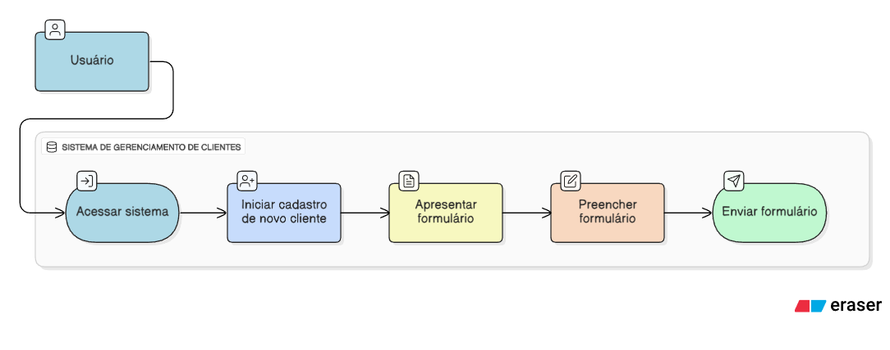

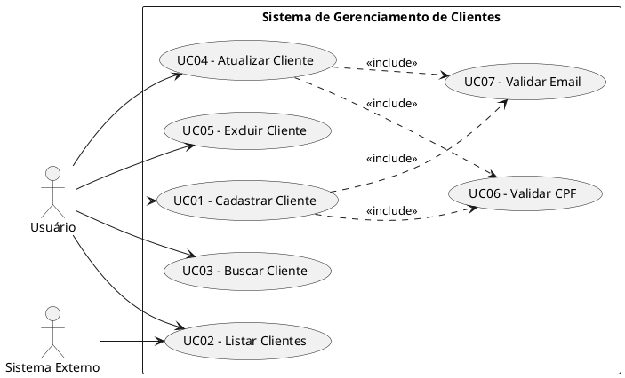

### 6.2 Detalhamento dos Casos de Uso

#### UC01 - Cadastrar Cliente

| Elemento              | Descrição                                                                                                                                                                                                    |
| --------------------- | ------------------------------------------------------------------------------------------------------------------------------------------------------------------------------------------------------------ |
| **Ator Principal**    | Usuário                                                                                                                                                                                                      |
| **Pré-condições**     | Sistema disponível                                                                                                                                                                                           |
| **Pós-condições**     | Cliente cadastrado no banco de dados                                                                                                                                                                         |
| **Fluxo Principal**   | 1. Usuário envia dados do cliente<br>2. Sistema valida CPF (UC06)<br>3. Sistema valida Email (UC07)<br>4. Sistema verifica duplicidade de CPF<br>5. Sistema persiste dados<br>6. Sistema retorna confirmação |
| **Fluxo Alternativo** | **FA01 - CPF Inválido:**<br>1. Sistema retorna erro de validação<br>**FA02 - CPF Duplicado:**<br>1. Sistema retorna erro de duplicidade<br>**FA03 - Email Inválido:**<br>1. Sistema retorna erro de formato  |
| **Fluxo de Exceção**  | **FE01 - Erro de Conexão:**<br>1. Sistema retorna erro 500                                                                                                                                                   |

#### UC02 - Listar Clientes

| Elemento              | Descrição                                                                                                  |
| --------------------- | ---------------------------------------------------------------------------------------------------------- |
| **Ator Principal**    | Usuário, Sistema Externo                                                                                   |
| **Pré-condições**     | Sistema disponível                                                                                         |
| **Pós-condições**     | Lista de clientes retornada                                                                                |
| **Fluxo Principal**   | 1. Ator solicita lista de clientes<br>2. Sistema busca dados no banco<br>3. Sistema retorna lista paginada |
| **Fluxo Alternativo** | **FA01 - Sem Clientes:**<br>1. Sistema retorna lista vazia                                                 |

#### UC03 - Buscar Cliente

| Elemento              | Descrição                                                                     |
| --------------------- | ----------------------------------------------------------------------------- |
| **Ator Principal**    | Usuário                                                                       |
| **Pré-condições**     | Cliente existente                                                             |
| **Pós-condições**     | Dados do cliente retornados                                                   |
| **Fluxo Principal**   | 1. Usuário informa ID<br>2. Sistema busca cliente<br>3. Sistema retorna dados |
| **Fluxo Alternativo** | **FA01 - Cliente Não Encontrado:**<br>1. Sistema retorna erro 404             |

#### UC04 - Atualizar Cliente

| Elemento              | Descrição                                                                                                                                                          |
| --------------------- | ------------------------------------------------------------------------------------------------------------------------------------------------------------------ |
| **Ator Principal**    | Usuário                                                                                                                                                            |
| **Pré-condições**     | Cliente existente                                                                                                                                                  |
| **Pós-condições**     | Dados atualizados                                                                                                                                                  |
| **Fluxo Principal**   | 1. Usuário envia ID e novos dados<br>2. Sistema valida CPF (UC06)<br>3. Sistema valida Email (UC07)<br>4. Sistema atualiza dados<br>5. Sistema retorna confirmação |
| **Fluxo Alternativo** | **FA01 - Cliente Não Encontrado:**<br>1. Sistema retorna erro 404<br>**FA02 - CPF Duplicado:**<br>1. Sistema retorna erro de duplicidade                           |

#### UC05 - Excluir Cliente

| Elemento              | Descrição                                                                                                              |
| --------------------- | ---------------------------------------------------------------------------------------------------------------------- |
| **Ator Principal**    | Usuário                                                                                                                |
| **Pré-condições**     | Cliente existente                                                                                                      |
| **Pós-condições**     | Cliente removido                                                                                                       |
| **Fluxo Principal**   | 1. Usuário informa ID<br>2. Sistema verifica existência<br>3. Sistema remove cliente<br>4. Sistema retorna confirmação |
| **Fluxo Alternativo** | **FA01 - Cliente Não Encontrado:**<br>1. Sistema retorna erro 404                                                      |

### 6.3 Diagrama de Classes


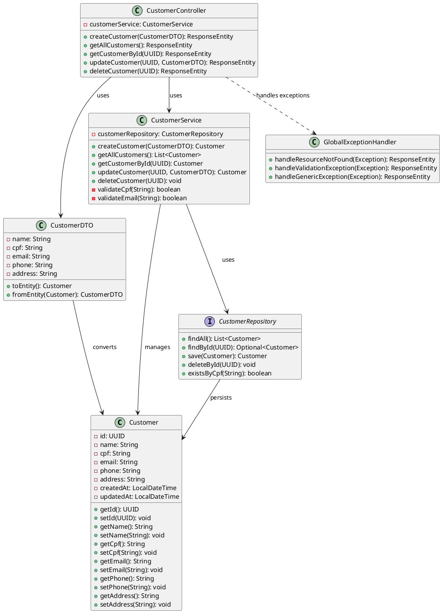

---

## 7. PROJETO ESTRUTURADO E ORIENTADO A OBJETOS

### 7.1 DTR - Diagrama de Tabelas Relacional (DER)

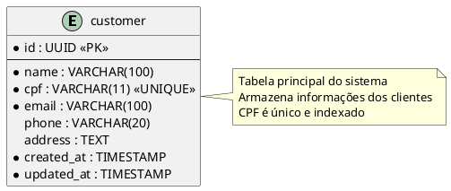

**Script SQL:**

```sql
CREATE TABLE customer (
    id UUID PRIMARY KEY DEFAULT gen_random_uuid(),
    name VARCHAR(100) NOT NULL,
    cpf VARCHAR(11) UNIQUE NOT NULL,
    email VARCHAR(100) NOT NULL,
    phone VARCHAR(20),
    address TEXT,
    created_at TIMESTAMP DEFAULT CURRENT_TIMESTAMP,
    updated_at TIMESTAMP DEFAULT CURRENT_TIMESTAMP
);

CREATE INDEX idx_customer_cpf ON customer(cpf);
CREATE INDEX idx_customer_email ON customer(email);
CREATE INDEX idx_customer_name ON customer(name);
```

---

## 8. DIAGRAMAS COMPORTAMENTAIS

### 8.1 Diagrama de Sequência - Cadastrar Cliente

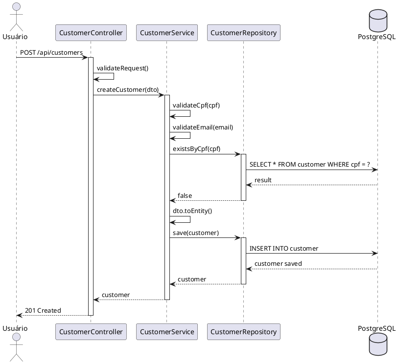

### 8.2 Diagrama de Sequência - Buscar Cliente

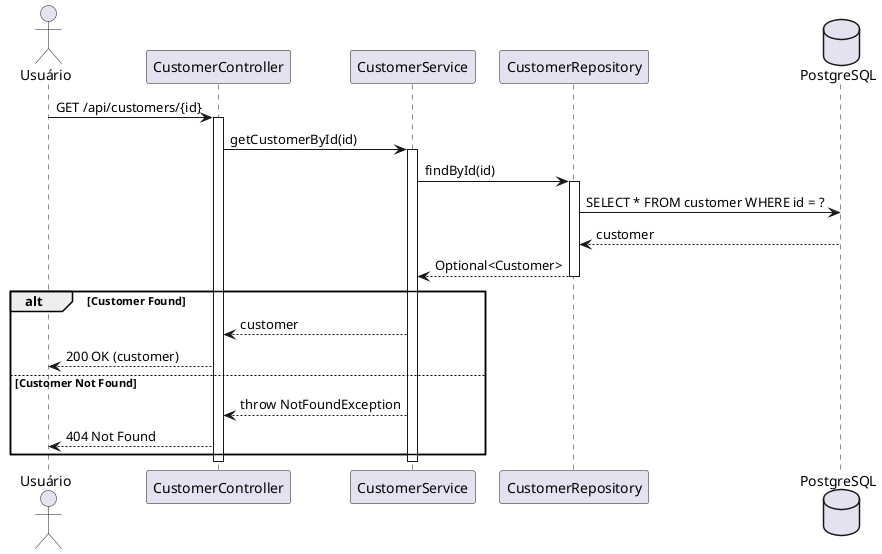

### 8.3 Diagrama de Colaboração - Atualizar Cliente

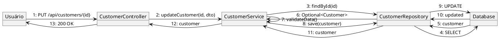

### 8.4 Diagrama de Atividades - Processo de Cadastro

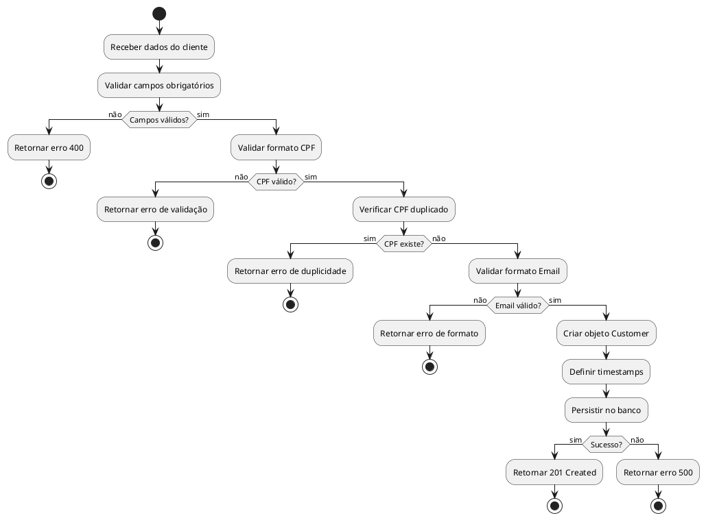

### 8.5 Diagrama de Atividades - Processo de Exclusão

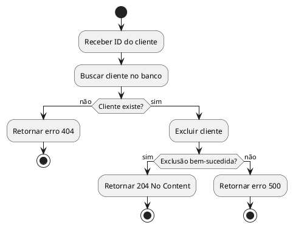

---

## 9. DIAGRAMAS DE ARQUITETURA

### 9.1 Diagrama de Componentes

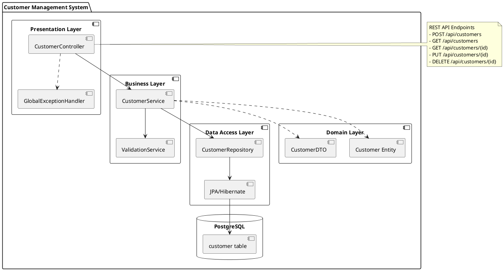

### 9.2 Diagrama de Implantação

```plantuml
@startuml
node "Client Device" {
  component [Web Browser/API Client]
}

node "Application Server" {
  component [Spring Boot Application] {
    artifact "customer-management.jar"
  }
  component [JVM 17+]
}

node "Database Server" {
  database "PostgreSQL 14+" {
    storage [customer_db]
  }
}

[Web Browser/API Client] -down-> [Spring Boot Application] : HTTP/HTTPS
[Spring Boot Application] -down-> [PostgreSQL 14+] : JDBC

note right of [Spring Boot Application]
  Port: 8080
  Profile: production
  Memory: 512MB-1GB
end note

note right of [PostgreSQL 14+]
  Port: 5432
  Max Connections: 100
end note
@enduml
```

---

## 10. CASOS DE TESTE

### CT01 - Cadastrar Cliente com Sucesso

| Elemento               | Descrição                                                                                                            |
| ---------------------- | -------------------------------------------------------------------------------------------------------------------- |
| **ID**                 | CT01                                                                                                                 |
| **Caso de Uso**        | UC01                                                                                                                 |
| **Objetivo**           | Validar cadastro de cliente com dados válidos                                                                        |
| **Pré-condições**      | CPF não cadastrado                                                                                                   |
| **Dados de Entrada**   | name: "João Silva"<br>cpf: "12345678901"<br>email: "joao@email.com"<br>phone: "11999999999"<br>address: "Rua A, 123" |
| **Passos**             | 1. Enviar POST /api/customers<br>2. Verificar resposta                                                               |
| **Resultado Esperado** | Status 201 Created<br>Cliente retornado com ID                                                                       |
| **Status**             | ✅ Pass                                                                                                              |

### CT02 - Cadastrar Cliente com CPF Duplicado

| Elemento               | Descrição                                               |
| ---------------------- | ------------------------------------------------------- |
| **ID**                 | CT02                                                    |
| **Caso de Uso**        | UC01                                                    |
| **Objetivo**           | Validar rejeição de CPF duplicado                       |
| **Pré-condições**      | CPF já cadastrado                                       |
| **Dados de Entrada**   | cpf: "12345678901" (já existente)                       |
| **Passos**             | 1. Enviar POST /api/customers<br>2. Verificar resposta  |
| **Resultado Esperado** | Status 400 Bad Request<br>Mensagem: "CPF já cadastrado" |
| **Status**             | ✅ Pass                                                 |

### CT03 - Cadastrar Cliente com CPF Inválido

| Elemento               | Descrição                                              |
| ---------------------- | ------------------------------------------------------ |
| **ID**                 | CT03                                                   |
| **Caso de Uso**        | UC01                                                   |
| **Objetivo**           | Validar formato de CPF                                 |
| **Pré-condições**      | Nenhuma                                                |
| **Dados de Entrada**   | cpf: "123" (inválido)                                  |
| **Passos**             | 1. Enviar POST /api/customers<br>2. Verificar resposta |
| **Resultado Esperado** | Status 400 Bad Request<br>Mensagem: "CPF inválido"     |
| **Status**             | ✅ Pass                                                |

### CT04 - Listar Todos os Clientes

| Elemento               | Descrição                                             |
| ---------------------- | ----------------------------------------------------- |
| **ID**                 | CT04                                                  |
| **Caso de Uso**        | UC02                                                  |
| **Objetivo**           | Validar listagem de clientes                          |
| **Pré-condições**      | Clientes cadastrados                                  |
| **Dados de Entrada**   | Nenhum                                                |
| **Passos**             | 1. Enviar GET /api/customers<br>2. Verificar resposta |
| **Resultado Esperado** | Status 200 OK<br>Lista de clientes                    |
| **Status**             | ✅ Pass                                               |

### CT05 - Buscar Cliente por ID Existente

| Elemento               | Descrição                                                  |
| ---------------------- | ---------------------------------------------------------- |
| **ID**                 | CT05                                                       |
| **Caso de Uso**        | UC03                                                       |
| **Objetivo**           | Validar busca de cliente específico                        |
| **Pré-condições**      | Cliente cadastrado                                         |
| **Dados de Entrada**   | id: UUID válido                                            |
| **Passos**             | 1. Enviar GET /api/customers/{id}<br>2. Verificar resposta |
| **Resultado Esperado** | Status 200 OK<br>Dados do cliente                          |
| **Status**             | ✅ Pass                                                    |

### CT06 - Buscar Cliente por ID Inexistente

| Elemento               | Descrição                                                  |
| ---------------------- | ---------------------------------------------------------- |
| **ID**                 | CT06                                                       |
| **Caso de Uso**        | UC03                                                       |
| **Objetivo**           | Validar erro para ID inexistente                           |
| **Pré-condições**      | Nenhuma                                                    |
| **Dados de Entrada**   | id: UUID não cadastrado                                    |
| **Passos**             | 1. Enviar GET /api/customers/{id}<br>2. Verificar resposta |
| **Resultado Esperado** | Status 404 Not Found<br>Mensagem: "Cliente não encontrado" |
| **Status**             | ✅ Pass                                                    |

### CT07 - Atualizar Cliente com Sucesso

| Elemento               | Descrição                                                  |
| ---------------------- | ---------------------------------------------------------- |
| **ID**                 | CT07                                                       |
| **Caso de Uso**        | UC04                                                       |
| **Objetivo**           | Validar atualização de dados                               |
| **Pré-condições**      | Cliente cadastrado                                         |
| **Dados de Entrada**   | id: UUID válido<br>name: "João Silva Jr"                   |
| **Passos**             | 1. Enviar PUT /api/customers/{id}<br>2. Verificar resposta |
| **Resultado Esperado** | Status 200 OK<br>Dados atualizados                         |
| **Status**             | ✅ Pass                                                    |

### CT08 - Excluir Cliente com Sucesso

| Elemento               | Descrição                                                     |
| ---------------------- | ------------------------------------------------------------- |
| **ID**                 | CT08                                                          |
| **Caso de Uso**        | UC05                                                          |
| **Objetivo**           | Validar exclusão de cliente                                   |
| **Pré-condições**      | Cliente cadastrado                                            |
| **Dados de Entrada**   | id: UUID válido                                               |
| **Passos**             | 1. Enviar DELETE /api/customers/{id}<br>2. Verificar resposta |
| **Resultado Esperado** | Status 204 No Content                                         |
| **Status**             | ✅ Pass                                                       |

### CT09 - Validar Email Inválido

| Elemento               | Descrição                                              |
| ---------------------- | ------------------------------------------------------ |
| **ID**                 | CT09                                                   |
| **Caso de Uso**        | UC01                                                   |
| **Objetivo**           | Validar formato de email                               |
| **Pré-condições**      | Nenhuma                                                |
| **Dados de Entrada**   | email: "email-invalido"                                |
| **Passos**             | 1. Enviar POST /api/customers<br>2. Verificar resposta |
| **Resultado Esperado** | Status 400 Bad Request<br>Mensagem: "Email inválido"   |
| **Status**             | ✅ Pass                                                |

### CT10 - Validar Campos Obrigatórios

| Elemento               | Descrição                                                |
| ---------------------- | -------------------------------------------------------- |
| **ID**                 | CT10                                                     |
| **Caso de Uso**        | UC01                                                     |
| **Objetivo**           | Validar obrigatoriedade de campos                        |
| **Pré-condições**      | Nenhuma                                                  |
| **Dados de Entrada**   | name: null                                               |
| **Passos**             | 1. Enviar POST /api/customers<br>2. Verificar resposta   |
| **Resultado Esperado** | Status 400 Bad Request<br>Mensagem: "Nome é obrigatório" |
| **Status**             | ✅ Pass                                                  |

---

## 11. PROTÓTIPOS DE TELA

### 11.1 Tela de Listagem de Clientes

```
┌─────────────────────────────────────────────────────────────────┐
│  Sistema de Gerenciamento de Clientes                    [≡]    │
├─────────────────────────────────────────────────────────────────┤
│                                                                   │
│  ┌──────────────────────────────────────────────────────┐       │
│  │ [+ Novo Cliente]                          [🔍 Buscar] │       │
│  └──────────────────────────────────────────────────────┘       │
│                                                                   │
│  ┌─────────────────────────────────────────────────────────────┐│
│  │ Nome          │ CPF           │ Email         │ Ações       ││
│  ├─────────────────────────────────────────────────────────────┤│
│  │ João Silva    │ 123.456.789-01│ joao@mail.com │ [✏️] [🗑️]   ││
│  │ Maria Santos  │ 987.654.321-00│ maria@mail.com│ [✏️] [🗑️]   ││
│  │ Pedro Oliveira│ 456.789.123-45│ pedro@mail.com│ [✏️] [🗑️]   ││
│  │ Ana Costa     │ 789.123.456-78│ ana@mail.com  │ [✏️] [🗑️]   ││
│  └─────────────────────────────────────────────────────────────┘│
│                                                                   │
│  ← Anterior  |  Página 1 de 10  |  Próximo →                    │
│                                                                   │
└─────────────────────────────────────────────────────────────────┘
```

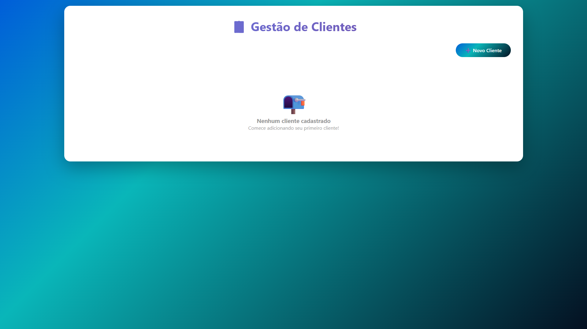

### 11.2 Tela de Cadastro de Cliente

```
┌─────────────────────────────────────────────────────────────────┐
│  Cadastrar Novo Cliente                               [✕]       │
├─────────────────────────────────────────────────────────────────┤
│                                                                   │
│  Nome Completo *                                                 │
│  ┌────────────────────────────────────────────────────────────┐ │
│  │ João da Silva                                              │ │
│  └────────────────────────────────────────────────────────────┘ │
│                                                                   │
│  CPF *                          Email *                          │
│  ┌──────────────────────────┐  ┌──────────────────────────────┐ │
│  │ 123.456.789-01           │  │ joao.silva@email.com         │ │
│  └──────────────────────────┘  └──────────────────────────────┘ │
│                                                                   │
│  Telefone                                                        │
│  ┌────────────────────────────────────────────────────────────┐ │
│  │ (11) 99999-9999                                            │ │
│  └────────────────────────────────────────────────────────────┘ │
│                                                                   │
│  Endereço                                                        │
│  ┌────────────────────────────────────────────────────────────┐ │
│  │ Rua das Flores, 123 - São Paulo/SP                        │ │
│  │                                                            │ │
│  └────────────────────────────────────────────────────────────┘ │
│                                                                   │
│  * Campos obrigatórios                                           │
│                                                                   │
│           [Cancelar]                    [Salvar Cliente]         │
│                                                                   │
└─────────────────────────────────────────────────────────────────┘
```


### 11.3 Tela de Editar Cliente

```
┌─────────────────────────────────────────────────────────────────┐
│  Detalhes do Cliente                                  [✕]       │
├─────────────────────────────────────────────────────────────────┤
│                                                                   │
│  ┌────────────────────────────────────────────────────────────┐ │
│  │                                                            │ │
│  │  Nome:        João da Silva                               │ │
│  │  CPF:         123.456.789-01                              │ │
│  │  Email:       joao.silva@email.com                        │ │
│  │  Telefone:    (11) 99999-9999                             │ │
│  │  Endereço:    Rua das Flores, 123 - São Paulo/SP         │ │
│  │                                                            │ │
│  │  Cadastrado em:  15/11/2024 às 14:30                     │ │
│  │  Atualizado em:  20/11/2024 às 10:15                     │ │
│  │                                                            │ │
│  └────────────────────────────────────────────────────────────┘ │
│                                                                   │
│                [Editar]  [Excluir]  [Fechar]                     │
│                                                                   │
└─────────────────────────────────────────────────────────────────┘
```

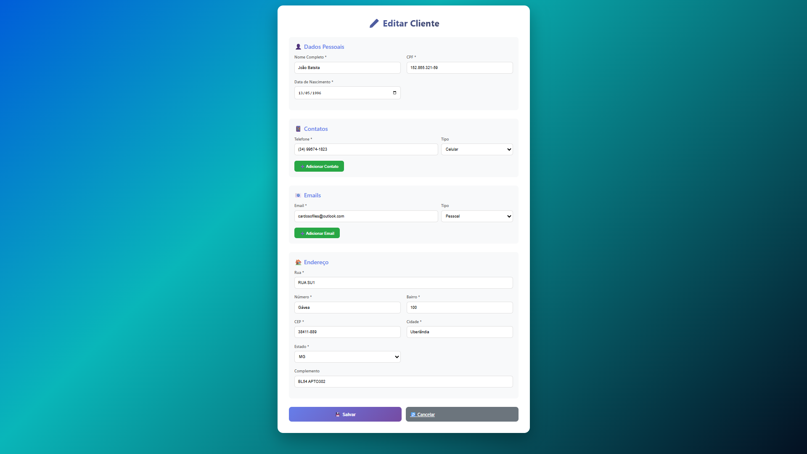

### 11.4 Tela de Confirmação de Exclusão

```
┌─────────────────────────────────────────────────────────────────┐
│  Confirmar Exclusão                                   [✕]       │
├─────────────────────────────────────────────────────────────────┤
│                                                                   │
│                           ⚠️                                      │
│                                                                   │
│        Deseja realmente excluir o cliente?                       │
│                                                                   │
│        Nome: João da Silva                                       │
│        CPF: 123.456.789-01                                       │
│                                                                   │
│        Esta ação não poderá ser desfeita!                        │
│                                                                   │
│                                                                   │
│              [Cancelar]         [Confirmar Exclusão]             │
│                                                                   │
└─────────────────────────────────────────────────────────────────┘
```

---

## 12. ARQUITETURA DO SISTEMA

### 12.1 Padrão de Arquitetura

O sistema utiliza arquitetura em camadas (Layered Architecture):

1. **Presentation Layer (Controladores)**

   - Responsável pela interface REST API
   - Validação inicial de requisições
   - Conversão de DTOs

2. **Business Layer (Serviços)**

   - Lógica de negócio
   - Validações de regras
   - Orquestração de operações

3. **Data Access Layer (Repositórios)**

   - Persistência de dados
   - Queries ao banco de dados
   - Gerenciamento de transações

4. **Domain Layer (Entidades)**
   - Modelos de domínio
   - DTOs
   - Value Objects

### 12.2 Tecnologias Utilizadas

| Camada         | Tecnologia      | Versão |
| -------------- | --------------- | ------ |
| Backend        | Java            | 17+    |
| Framework      | Spring Boot     | 3.x    |
| Persistência   | Spring Data JPA | 3.x    |
| Banco de Dados | PostgreSQL      | 14+    |
| Build          | Maven           | 3.8+   |
| Documentação   | Swagger/OpenAPI | 3.0    |

---

## 13. CONCLUSÃO

Este documento apresenta a especificação completa do Sistema de Gerenciamento de Clientes, contemplando:

- ✅ Levantamento completo de requisitos
- ✅ Análise orientada a objetos com UML
- ✅ Diagramas estruturais e comportamentais
- ✅ Casos de teste detalhados
- ✅ Protótipos de interface
- ✅ Arquitetura e tecnologias

O sistema está projetado para atender às necessidades de gerenciamento de clientes com:

- **Segurança**: Validação robusta de dados
- **Escalabilidade**: Arquitetura em camadas
- **Manutenibilidade**: Código organizado e documentado
- **Performance**: Otimização de queries e índices

---

## 14. REFERÊNCIAS

- Sommerville, Ian. **Engenharia de Software**. 10ª edição.
- Pressman, Roger S. **Engenharia de Software: Uma Abordagem Profissional**. 8ª edição.
- Fowler, Martin. **UML Distilled**. 3ª edição.
- Spring Framework Documentation. https://spring.io/projects/spring-boot
- PostgreSQL Documentation. https://www.postgresql.org/docs/

---

## 15. ANEXOS

### Anexo A - Endpoints da API

| Método | Endpoint            | Descrição         |
| ------ | ------------------- | ----------------- |
| POST   | /api/customers      | Criar cliente     |
| GET    | /api/customers      | Listar clientes   |
| GET    | /api/customers/{id} | Buscar cliente    |
| PUT    | /api/customers/{id} | Atualizar cliente |
| DELETE | /api/customers/{id} | Excluir cliente   |

### Anexo B - Códigos de Status HTTP

| Código | Descrição             | Uso                     |
| ------ | --------------------- | ----------------------- |
| 200    | OK                    | Requisição bem-sucedida |
| 201    | Created               | Recurso criado          |
| 204    | No Content            | Exclusão bem-sucedida   |
| 400    | Bad Request           | Dados inválidos         |
| 404    | Not Found             | Recurso não encontrado  |
| 500    | Internal Server Error | Erro no servidor        |

### Anexo C - Estrutura do Projeto

```
CRUDcustomers-management-server/
├── src/
│   ├── main/
│   │   ├── java/
│   │   │   └── com/example/customers/
│   │   │       ├── controller/
│   │   │       ├── service/
│   │   │       ├── repository/
│   │   │       ├── model/
│   │   │       ├── dto/
│   │   │       └── exception/
│   │   └── resources/
│   │       └── application.properties
│   └── test/
├── docs/
│   └── ESPECIFICACAO_REQUISITOS.md
├── pom.xml
└── README.md
```
